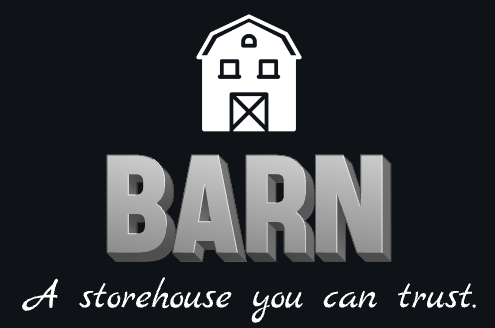

# Barn

<p align="center">
  
</p>

## About

Barn is a CLI tool for managing tokenization and detokenization of data through a simple HTTP API server. It provides a convenient way to tokenize data and later retrieve the original data using unique tokens.

## Installation

You can install Barn using Homebrew. Follow these steps:

1. **Tap the Repository**:
    ```sh
    brew tap 1byteword/barn https://github.com/1byteword/homebrew-tap
    ```

2. **Install Barn**:
    ```sh
    brew install barn
    ```

## Usage

### Start the Server

To start the Barn server, run:
```sh
./barn serve --address 127.0.0.1:8000
```

### Tokenize Data

To tokenize data, run:
```sh
./barn tokenize --data item1
```
### Detokenize Data

To detokenize data, run:
```sh
./barn detokenize --data field1
```
Replace the items and fields above with your actual data and fields.

### Example Workflow

1. **Start the Server**:
    ```sh
    ./barn serve --address 127.0.0.1:8000
    ```

2. **Tokenize Data**:
    ```sh
    ./barn tokenize --data item1
    ```

    Example response:
    ```json
    {
      "field1": "item1"
    }
    ```

3. **Detokenize Data**:
    ```sh
    ./barn detokenize --data field1
    ```

    Example response:
    ```json
    [
      "item1"
    ]
    ```

### Viewing Logs

To view detailed logs of tokenization and detokenization activities, set the `RUST_LOG` environment variable to `info` before starting the server:

```sh
RUST_LOG=info ./barn serve --address 127.0.0.1:8000
```

# License
This project is licensed under the MIT License.