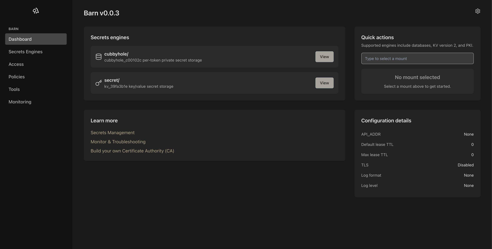

# Barn
                                               
<p align="center">
  
</p>

## About

Barn is a CLI tool that not only manages tokenization and detokenization of data but also securely encrypts and decrypts data using a robust cryptographic approach with the XChaCha20Poly1305 algorithm. This Rust-based HTTP API server offers an effective way to encrypt data and securely store it, allowing for the retrieval of the original data using unique keys.

## Installation

You can install Barn using Homebrew. Follow these steps:

1. **Tap the Repository**:
    ```sh
    brew tap 1byteword/barn https://github.com/1byteword/homebrew-tap
    ```

2. **Install Barn**:
    ```sh
    brew install barn
    ```

## Usage



### Start the Server

To start the Barn server, run:
```sh
./barn serve --address 127.0.0.1:8000

### Encrypt and Store Data

To securely store data with encryption, use the following curl command:

```bash
curl -X POST http://127.0.0.1:8000/store -H 'Content-Type: application/json' -d '{\"key\": \"exampleKey\", \"value\": \"exampleValue\"}'
```

This command encrypts the value and stores it under the specified key.

### Decrypt and Retrieve Data

To retrieve and decrypt data, use the following curl command:

```bash
curl -X POST http://127.0.0.1:8000/load -H 'Content-Type: application/json' -d '{\"key\": \"exampleKey\"}'
```

This retrieves the encrypted data using the specified key and decrypts it.

### Example Workflow

1. **Start the Server**:
    ```bash
    ./barn serve --address 127.0.0.1:8000
    ```

2. **Encrypt and Store Data**:
    ```bash
    curl -X POST http://127.0.0.1:8000/store -H 'Content-Type: application/json' -d '{"key": "exampleKey", "value": "exampleValue"}'
    ```

    Example response:
    ```json
    {
      "message": "Key-value pair stored successfully"
    }
    ```

3. **Decrypt and Retrieve Data**:
    ```bash
    curl -X POST http://127.0.0.1:8000/load -H 'Content-Type: application/json' -d '{"key": "exampleKey"}'
    ```

    Example response:
    ```json
    {
      "value": "exampleValue"
    }
    ```

### Viewing Logs

For detailed logs of server activities, including encryption and decryption operations, set the `RUST_LOG` environment variable to `info` before starting the server:

```bash
RUST_LOG=info ./barn serve --address 127.0.0.1:8000
```